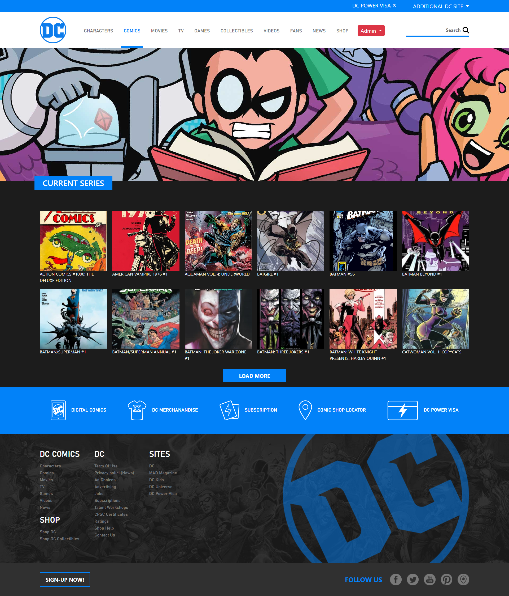
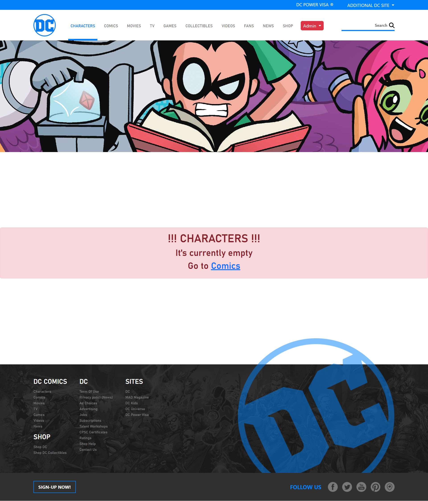
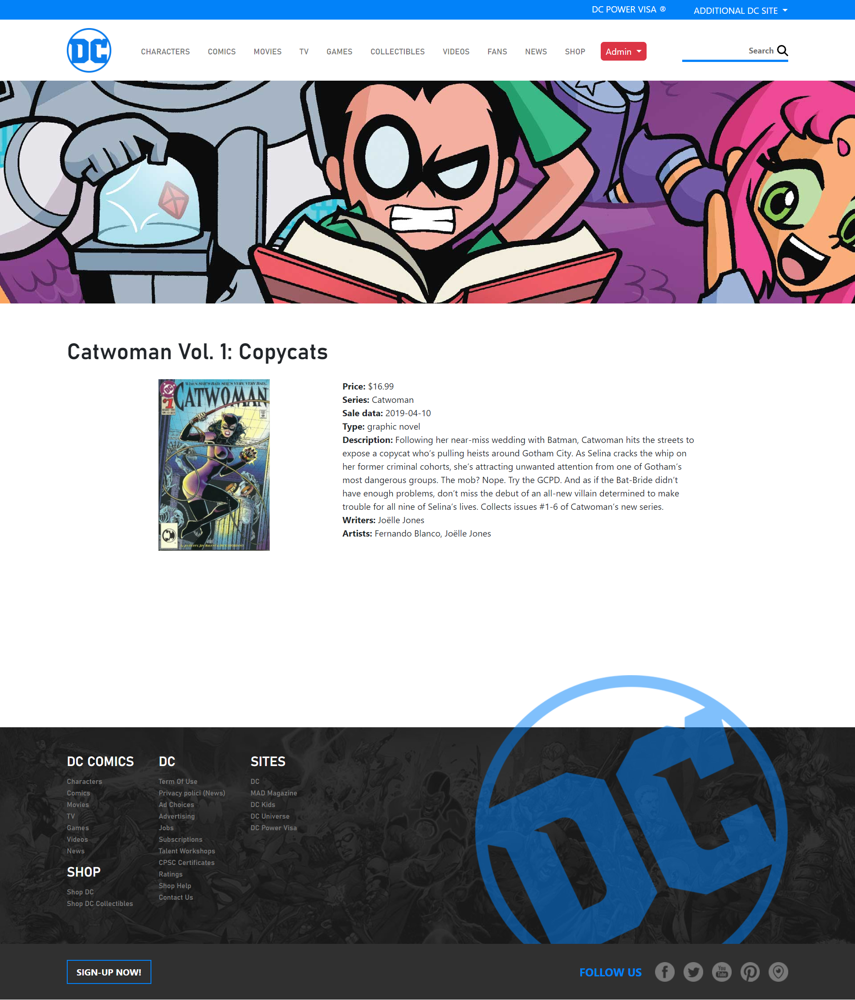
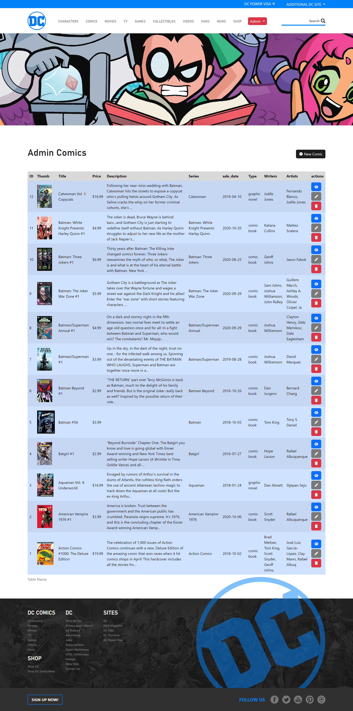

# DC Comics - Replica web-site

**Initial commit**: 07/05/23

**Tecnologie:** Laravel, PHP, Blade, MySql, Javascript, HTML, CSS e Bootstrap.

**Info:** 🦸🏻‍♂️ DC Comics! A project that accompanied us during the Boolean journey, has been updated from time to time with the technology learned in lessons, this is the latest version. In this exercise we implemented the CRUD (create/read/update/delete) to manage the persistence of the Comics in the Database then through the routes and the PageControler we managed the navigation between the various pages of the site. Finally, with the Blade template, I was able to populate the html code dynamically.

## Pages Preview

  
  
  

## Milestone
- [x] Create a Laravel 9 project to manage a comic archive.
- [x] Create [app.blade.php](resources/views/layouts/app.blade.php) a layout file in which to insert the common structure of all the pages of the website
- [x] Structure the layout using partials.
- [x] Add multiple pages that share the same layout
- [x] Create the `comics` route to display the list of all comics
- [x] Retrieve the comics from the [comics.php](config/comics.php) file placed in the config folder
- [x] Recycle the Sass template from the [vite-comics](https://github.com/cyberfolk/vite-comics) exercise.
- [x] Using the appropriate artisanal commands, create a model with relative migration and a Resource Controller.
- [x] Define the CRUD operations with the related views: `index()`, `show()`, `create()`, and `store()`
- [x] Create the seeder for the **Comics** table using the file in [comics.php](config/comics.php).
- [x] Via JS, when the user clicks on the "delete" button, ask for confirmation of deletion before deleting the element.
- [x] Validate the inputs received during the creation/modification phase, responding with clear errors and in Italian.
- [x] Use custom requests to validate data

## Admin-page

